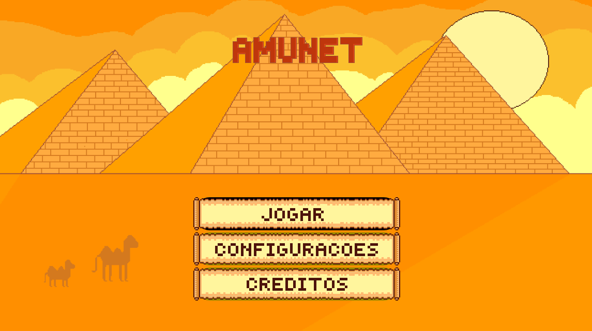

# 2026-303-Amunet
Repositório referente ao jogo da disciplina de Tópicos Avançados de Programação Orientada a Objetos

<!DOCTYPE html>
<html lang="pt-BR">
<head>
  <meta charset="UTF-8">
  <meta name="viewport" content="width=device-width, initial-scale=1.0">
  <title>README Preview</title>
</head>
<body>

  <h1>2026-303-Amunet</h1>

  

    Repositório referente ao jogo da disciplina de Tópicos Avançados de
    Programação Orientada a Objetos
  

  

    Na parte visual, nosso menu possui elementos que fazem referência ao
    Egito Antigo, como os botões em formato de pergaminho e o próprio fundo.
  

  <!-- Imagem -->
  

</body>
</html>
